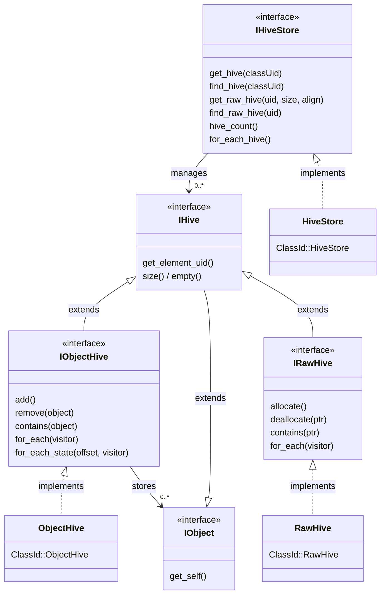
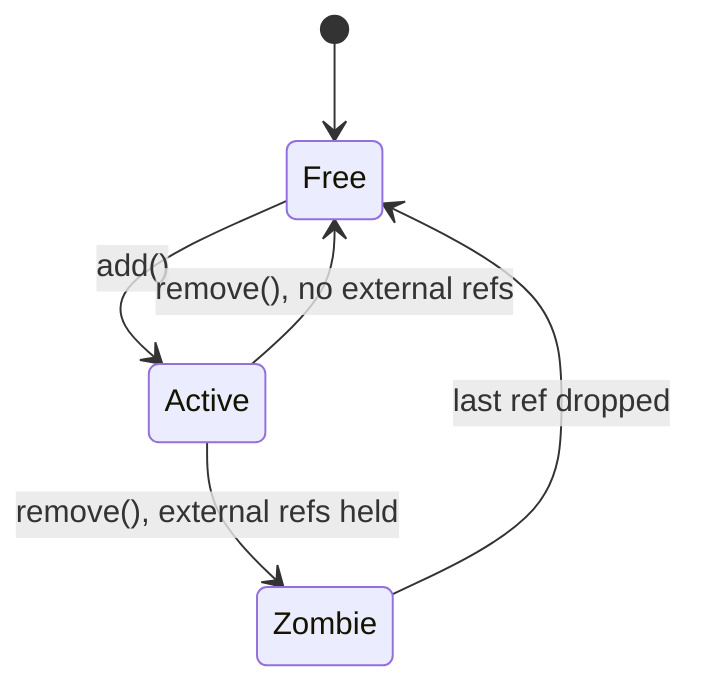

# Hive

A hive is a dense, typed container that stores elements contiguously in memory. Instead of allocating each element individually on the heap, a hive groups elements into cache-friendly pages and constructs them in place. This is useful for systems that manage large numbers of homogeneous objects (entities, particles, nodes) where iteration performance matters.

The design shares core ideas with C++26's `std::hive` (P0447): paged allocation, O(1) erase via a per-page freelist, stable references across insertion and removal, and no element shifting. Velk provides two hive types:

**Object hives** (`IObjectHive`) store full Velk objects with reference counting, interface dispatch, metadata, and zombie/orphan lifetime management. Objects can be passed around as `IObject::Ptr` and removed objects can [outlive the hive itself](#lifetime-and-zombies) if external references still hold them.

**Raw hives** (`IRawHive`) store plain data without reference counting overhead. They provide type-erased slot allocation and deallocation, with a typed `RawHive<T>` wrapper for convenient construction and destruction. Raw hives are ideal for particles, transforms, spatial nodes, and other plain data that doesn't need Velk object machinery.

Both hive types share a common base interface (`IHive`) and can be managed from the same `IHiveStore`.

## Contents

- [Class diagram](#class-diagram)
- [Getting started](#getting-started)
- [Hive store](#hive-store)
- [Adding objects](#adding-objects)
- [Removing objects](#removing-objects)
- [Iterating objects](#iterating-objects)
- [Checking membership](#checking-membership)
- [Raw hives](#raw-hives)
- [Object flags](#object-flags)
- [Lifetime and zombies](#lifetime-and-zombies)
- [Thread safety](#thread-safety)
- [Memory layout](#memory-layout)
- [Performance](#performance)

## Class diagram



## Getting started

The hive system is built into Velk. No setup is required. Create a hive store and start adding objects:

```cpp
#include <velk/interface/hive/intf_hive_store.h>

auto& velk = instance();
auto registry = velk.create<IHiveStore>(ClassId::HiveStore);

// Get (or create) a hive for MyWidget objects
auto hive = registry->get_hive<MyWidget>();

// Add objects
auto obj = hive->add();
```

## Hive store

The hive store manages hives, one per class UID. Create one via `ClassId::HiveStore` and use the `IHiveStore` interface for lazy creation and lookup:

```cpp
auto registry = instance().create<IHiveStore>(ClassId::HiveStore);

// get_hive: returns the hive for the class, creating it if needed
auto hive = registry->get_hive(MyWidget::class_id());

// find_hive: returns the hive if it exists, nullptr otherwise
auto hive = registry->find_hive(MyWidget::class_id());

// Templated versions (use T::class_id() internally)
auto hive = registry->get_hive<MyWidget>();
auto hive = registry->find_hive<MyWidget>();
```

You can enumerate all active hives (both object and raw):

```cpp
registry->hive_count();  // number of active hives

registry->for_each_hive(nullptr, [](void*, IHive& hive) -> bool {
    // hive.get_element_uid(), hive.size(), ...
    return true;  // return false to stop early
});
```

Multiple hive stores can coexist independently. Each store maintains its own set of hives.

## Adding objects

`IObjectHive::add()` constructs a new object in the hive and returns a shared pointer:

```cpp
auto hive = registry->get_hive<MyWidget>();

IObject::Ptr obj = hive->add();
auto widget = interface_pointer_cast<IMyWidget>(obj);
widget->width().set_value(200.f);
```

The returned pointer behaves identically to one from `instance().create()`. The object has metadata, supports `interface_cast`, and participates in reference counting.

## Removing objects

`IObjectHive::remove()` removes an object from the hive:

```cpp
hive->remove(*obj);
```

After removal, the object's slot becomes available for reuse. If external references to the object still exist, the object stays alive until the last reference is dropped (see [Lifetime and zombies](#lifetime-and-zombies)).

## Iterating objects

The `api/hive/iterate.h` header provides `for_each_hive` overloads that accept capturing lambdas directly, avoiding the C-style `void* context` + function pointer pattern on the raw `IObjectHive` interface.

```cpp
#include <velk/api/hive/iterate.h>
```

The basic overload iterates all live objects:

```cpp
for_each_hive(*hive, [&](IObject& obj) {
    auto* widget = interface_cast<IMyWidget>(&obj);
    // ...
    return true;  // return false to stop early
});
```

Objects are stored contiguously within pages, so iteration has good cache locality compared to individually heap-allocated objects. Both iteration paths prefetch the next active slot before calling the visitor to reduce cache stalls.

### State iteration

When every element needs access to the same interface's property state (the common case for bulk updates, physics ticks, rendering passes, etc.), the state overload eliminates the per-element `interface_cast` and virtual `get_property_state()` calls entirely:

```cpp
for_each_hive<IMyWidget>(*hive, [&](IObject& obj, IMyWidget::State& s) {
    sum += s.width + s.height;
    return true;
});
```

Because all objects in a hive share the same class layout, the byte offset from object start to `IMyWidget::State` is the same for every element. `for_each_hive<T>` computes that offset once from the first live object, then passes a direct `State&` to the visitor via pointer arithmetic. No virtual calls happen inside the hot loop.

This matters when the visitor body is cheap relative to the dispatch overhead. For a visitor that reads 10 fields, the state path is roughly 40% faster than the `interface_cast` path (see [Performance](#performance)). If the visitor already does expensive work per element (allocations, I/O, deep call chains), the dispatch cost is negligible and either overload works fine.

### Low-level API

The typed overloads wrap `IObjectHive::for_each()` and `IObjectHive::for_each_state()`. You can call these directly if you need to cache the state offset across multiple iterations or pass through a C-style context pointer:

```cpp
// Compute offset from any live object in the hive.
ptrdiff_t offset = -1;
hive->for_each(&offset, [](void* ctx, IObject& obj) -> bool {
    auto* ps = interface_cast<IPropertyState>(&obj);
    void* state = ps->get_property_state(IMyWidget::UID);
    if (state) {
        *static_cast<ptrdiff_t*>(ctx) = static_cast<ptrdiff_t>(
            reinterpret_cast<uintptr_t>(state) - reinterpret_cast<uintptr_t>(&obj));
    }
    return false; // stop after first
});

// Use the cached offset for repeated iterations.
hive->for_each_state(offset, &my_ctx, [](void* ctx, IObject& obj, void* state) -> bool {
    auto& s = *static_cast<IMyWidget::State*>(state);
    // ...
    return true;
});
```

## Checking membership

```cpp
hive->contains(*obj);  // true if the object is in this hive
hive->size();           // number of live objects
hive->empty();          // true if no objects
```

## Raw hives

Raw hives store plain data without Velk object overhead. They provide O(1) allocation and deallocation with the same page-based contiguous storage as object hives, but without reference counting, metadata, or zombie management.

### Creating a raw hive

```cpp
#include <velk/api/hive/raw_hive.h>
#include <velk/interface/hive/intf_hive_store.h>

struct Particle {
    float x, y, z;
    float vx, vy, vz;
};

auto registry = instance().create<IHiveStore>(ClassId::HiveStore);

// Get (or create) a raw hive for Particle
auto raw = registry->get_raw_hive<Particle>();

// Wrap in the typed helper
RawHive<Particle> hive(raw);
```

### Adding and removing elements

```cpp
// emplace constructs in-place (like std::vector::emplace_back)
Particle* p = hive.emplace(1.f, 2.f, 3.f, 0.f, 0.f, 0.f);

// deallocate destroys and reclaims the slot
hive.deallocate(p);
```

### Iterating elements

```cpp
// void-returning visitor (visits all elements)
hive.for_each([](Particle& p) {
    p.x += p.vx;
    p.y += p.vy;
    p.z += p.vz;
});

// bool-returning visitor (return false to stop early)
hive.for_each([](Particle& p) -> bool {
    if (p.y < 0.f) return false;
    return true;
});
```

### Low-level API

The `IRawHive` interface provides type-erased access for C-style interop:

```cpp
void* slot = raw->allocate();
auto* p = new (slot) Particle{};
// ...
p->~Particle();
raw->deallocate(slot);
```

### Thread safety

Raw hives use the same locking strategy as object hives:

| Operation | Lock |
|---|---|
| `allocate()` | exclusive |
| `deallocate()` | exclusive |
| `for_each()` | shared |
| `contains()` | shared |
| `size()`, `empty()` | none |

## Object flags

Objects created by a hive have the `ObjectFlags::HiveManaged` flag set. This allows code to check whether an object is hive-managed without needing a reference to the hive:

```cpp
if (obj->get_object_flags() & ObjectFlags::HiveManaged) {
    // object was created by a hive
}
```

## Lifetime and zombies

A hive holds one strong reference to each of its objects. When you call `add()`, the returned `IObject::Ptr` is a second strong reference. The hive's internal reference keeps the object alive even if the caller drops their pointer.

When `remove()` is called, the hive releases its strong reference. If no external references remain, the object is destroyed immediately and the slot is recycled. If external references still exist, the object enters a **zombie** state: it is no longer visible to `for_each()` or counted by `size()`, but it remains alive in its slot until the last reference is dropped.

When the last reference to a zombie drops, the destructor runs in place and the slot is returned to the page's free list for reuse.

When a hive is destroyed (e.g. its store is released), all active objects are released. Any objects that still have external references become orphans. The underlying page memory is kept alive until the last orphan is destroyed, then freed automatically.

### Slot lifecycle

Each slot in a hive page transitions through three states:



## Thread safety

The hive uses a `shared_mutex` internally to protect its state. Mutating and read-only operations acquire the appropriate lock automatically:

| Operation | Lock |
|---|---|
| `add()` | exclusive |
| `remove()` | exclusive |
| `for_each()`, `for_each_state()` | shared |
| `contains()` | shared |
| `size()`, `empty()` | none (read a single counter) |

Multiple threads can safely call any combination of these operations concurrently. Readers (`for_each`, `contains`) run in parallel with each other, while writers (`add`, `remove`) are serialized and block readers.

If a `for_each` visitor attempts to call `add()` or `remove()` on the same hive, the exclusive lock request will deadlock against the shared lock already held by `for_each`. This is intentional: it turns what would otherwise be silent undefined behavior into an immediate, diagnosable hang.

```cpp
// Safe: two threads adding concurrently
// Thread A                    // Thread B
hive->add();                   hive->add();

// Safe: iterating while another thread adds
// Thread A                    // Thread B
for_each_hive(*hive, ...);     hive->add();   // blocks until iteration finishes

// Deadlock (by design): mutating from inside a visitor
for_each_hive(*hive, [&](IObject& obj) {
    hive->remove(obj);  // deadlock: exclusive lock vs. held shared lock
    return true;
});
```

When a removed object's last external reference is dropped from any thread, the slot reclamation callback acquires an exclusive lock to safely modify the freelist and bitmask. This blocks if iteration is in progress, ensuring the page state stays consistent.

Slot reclamation for orphaned pages (pages that outlive their hive) is lock-free because the owning hive and its mutex no longer exist.

## Memory layout

Objects are stored in chunked pages. Each page is a contiguous, aligned allocation sized for a fixed number of slots. Pages grow as needed:

| Page | Slot count |
|------|-----------|
| 1st  | 16        |
| 2nd  | 64        |
| 3rd  | 256       |
| 4th+ | 1024      |

Free slots within a page are linked through an intrusive free list stored in the slot memory itself, so there is no per-slot overhead for free slots. Each page also maintains a per-slot state byte (`Active`, `Zombie`, or `Free`), an active-slot bitmask (one bit per slot, packed into `uint64_t` words), and a contiguous array of embedded control blocks.

Slot reuse is LIFO within a page: the most recently freed slot is the next one allocated. This keeps active objects as dense as possible within each page.

## Performance

All benchmarks use 512 elements with 10 members (5 floats + 5 ints). Measured on x64 (16 cores, 32 MiB L3), MSVC Release, Google Benchmark. Source: `benchmark/main.cpp`.

### What you get

**Object hive** (128 B per element): ref-counted lifetime with `shared_ptr`/`weak_ptr`, runtime interface dispatch, lazy metadata, zombie/orphan safety, thread-safe mutation, and `ObjectFlags::HiveManaged` tagging.

**Raw hive** (element size only): O(1) allocation and deallocation, contiguous paged storage, bitmask iteration, thread-safe mutation. No ref-counting or interface dispatch overhead.

### Containers under test

| Label | Description |
|---|---|
| `std::vector<PlainData>` | vector of 40-byte structs |
| `std::vector<unique_ptr<T>>` | vector with virtual base + destructor |
| `RawHive<PlainData>` | `ClassId::RawHive`storing the same 40-byte struct |
| `std::vector<IObject::Ptr>` | vector of heap-allocated Velk objects |
| `IObjectHive`::Ptr | Velk objects in a `ClassId::ObjectHive`, [Full functionality](#what-you-get) |

### Results

| Container | Create (ns) | Iterate (read, ns) | Iterate (write, ns) | Churn (ns) | Element size (bytes) |
|---|---|---|---|---|---|
| `std::vector<PlainData>`| ~580 | ~640 | ~740 | ~7,400 | 40 |
| `std::vector<unique_ptr<T>>` | ~16,500 | ~760 | ~760 | ~20,400 <br>~17,700 [(2)](#note-2) | 40 + ptr |
| `RawHive<PlainData>` | ~4,800 | ~2,100 | ~2,040 | ~2,000 | 40 |
| `std::vector<IObject::Ptr>` | ~40,600 | ~4,800 | ~4,900 | ~30,700 | 128 |
| Object hive | ~10,300 | ~3,800 <br>~2,360 [(1)](#note-1) | ~3,980 <br>~2,370 [(1)](#note-1) | ~5,900 | 128 |

#### Note 1 
Velk object rows use `get_property_state<T>()` for direct state access. The object hive read/write columns show two values: 
* the first uses `interface_cast` per element
* the second uses `for_each_hive<T>()` which [pre-computes the state offset once](#state-iteration).

#### Note 2
The heap vector churn column shows two values: unlocked and locked (each insert/erase wrapped in `std::mutex`).

### Analysis

#### Creation

Both hive types use placement-new into pre-allocated pages, avoiding per-element heap allocations. The raw hive is the fastest pooled option (~8x faster than plain `make_unique`) since it skips ref-counting setup and control block allocation. The object hive is ~4x faster than Velk heap allocation.

####### Iteration

The heap vector iterates nearly as fast as the plain vector here because `make_unique` in a tight loop produces nearly contiguous allocations; real applications with interleaved allocations would see more cache misses.

The raw hive iterates at ~2,100 ns, within ~3.3x of a plain vector and comparable to the object hive's state path. Both hive types prefetch the next active slot and scan a per-page bitmask (`_BitScanForward64`) to skip free slots in bulk. The small gap vs. a plain vector comes from the bitmask scan and function pointer callback overhead.

#### Churn

The raw hive is the clear winner at ~2,000 ns, ~3.7x faster than a plain vector and ~2.9x faster than the object hive. All hive types use O(1) removal (clear a bit + push to freelist) and LIFO slot reuse with zero heap allocations. Vectors pay O(n) element shifting per erase. The raw hive's advantage over the object hive comes from skipping ref-count manipulation and zombie lifecycle management.
